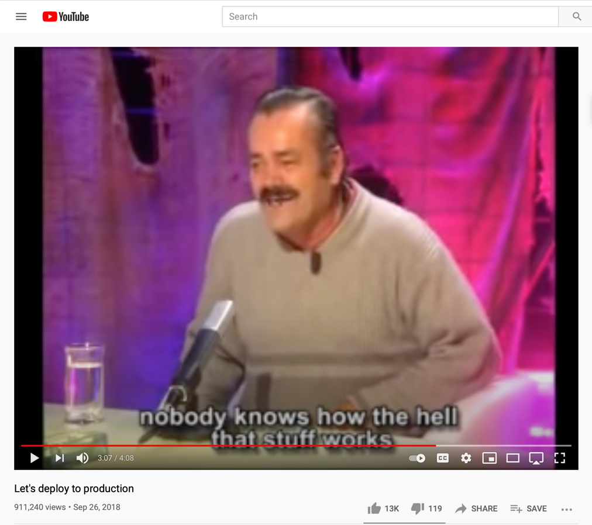

# Week 4: Deployment & Production Setup

> No Deploy Fridays
>
> — [@iamdevloper](https://twitter.com/iamdevloper/status/1108993784132587520)

## Table of Contents

- [Slides](#slides)
- [Theory](#theory)
- [Review](#review)
- [Assessment](#assesment)
- [Hand in](#hand-in)

## Slides

- [Lab-4][lab4]

## Theory

- [_Node.js, the difference between development and production_](https://nodejs.dev/learn/nodejs-the-difference-between-development-and-production)
- [_Express Tutorial Part 7: Deploying to production_](https://developer.mozilla.org/en-US/docs/Learn/Server-side/Express_Nodejs/deployment)

## Assignments

### Deploy your App!

> Put your app on the web!

Deploy your web app to a _hosting service_. This'll allow others to view your
app on the web! There are
[various options available](https://nodejs.dev/learn/where-to-host-a-nodejs-app),
but we recommend looking at the following:

- [Glitch](https://glitch.com/): Good for demo purposes but there are some
  [_restrictions_](https://glitch.com/faq#restrictions).
- [Vercel](https://vercel.com): By far the easiest and fastest way to deploy.
- Platform As A Service:
  [Heroku](https://devcenter.heroku.com/articles/getting-started-with-nodejs):
  Needs more config then Vercel but is more powerful.
- Virtual Private Server [DigitalOcean](https://www.digitalocean.com/): The most
  hardcore way to-go. They just provide an empty linux and you need to set-up on
  your own.

Before you put anything online for the world to see, make sure you have:

- put your private variables in a `.env` file, and that you have this file
  listed in `.gitignore`;
- ignored `node_modules` from git by putting it in `.gitignore`
- updated your readme with a description of your app, and have added
  instructions on how to install and run it

## Hand In

1. **Push your Changes**  
   Commit and push any progress in your repo. Document all research you did in
   your wiki.

2. **Create an Issue**  
   Mark this assignment as completed by opening an issue on our
   [Issue Tracker](https://github.com/cmda-bt/pt-course-20-21/issues/new/choose).
   Fill in the issue template of `week-3` with the correct information.

3. **Feedback**  
   Any thoughts/feelings/concerns/opinions about these assignments? Let us know!
   We optimize these classes year-to-year, so your feedback is invaluable in
   making this course better.
